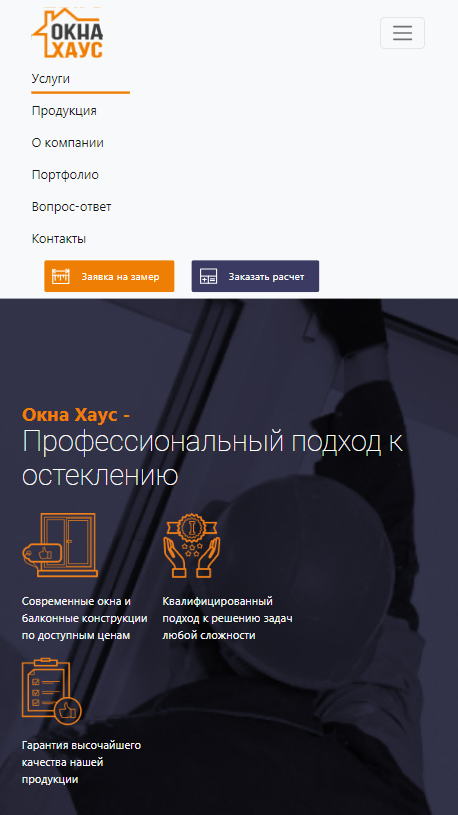

# Window
Одностраничник адаптируемый на разные разрешения экрана были преимущественно использован boostrap с модулем scss.
## Технологии


## Bootstrap
При уменьшении разрешения до 992px на экране выходит кнопка с навигацией. 
``` html
<header class="header">
        <div class="container">
            <nav class="navbar navbar-expand-lg">
                <div class="container-fluid">
                    <a class="navbar-brand me-5" href="#"></a>
                    <button class="navbar-toggler" type="button" data-bs-toggle="collapse"
                        data-bs-target="#navbarNavAltMarkup" aria-controls="navbarNavAltMarkup" aria-expanded="false"
                        aria-label="Toggle navigation">
                        <span class="navbar-toggler-icon"></span>
                    </button>
                    <div class="collapse navbar-collapse" id="navbarNavAltMarkup">
                        <div class="navbar-nav text-nowrap main-nav">
                            <a class="nav-link active" href="#">Услуги </a>
                            <a class="nav-link active active-nav w-25 " href="#">Продукция</a>
                            <a class="nav-link active" href="#">О компании</a>
                            <a class="nav-link active" href="#">Портфолио</a>
                            <a class="nav-link active" href="#">Вопрос-ответ</a>
                            <a class="nav-link active" href="#">Контакты</a>
                        </div>
                        <button class="btn1 ms-3 mt-2" type="button">Заявка на замер</button>
                        <button class="btn2 ms-3 mt-2" type="button">Заказать расчет</button>
                    </div>
                </div>
            </nav>
        </div>
    </header>

```


## Команда проекта


- [Макыев Данияр] — Front-End developer

## Источники
[Figma](https://www.figma.com/file/ZSweoUdNocvDTQTVtH6fZZ/window-haus?type=design&node-id=15-264&mode=design&t=J968tDFSwfeJH5Ft-0)
